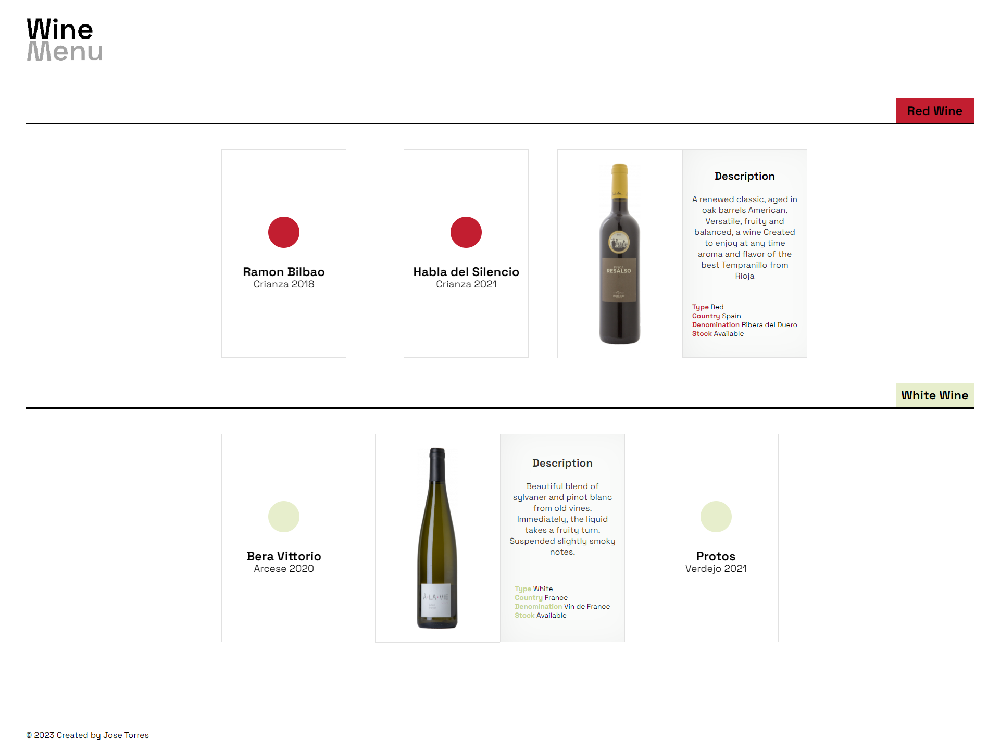

# OOP Basics

## Comenzando 🚀

This is a basic oop exercise with PHP.
The theme chosen for this project is a wine menu.
The requirements consist of:
⦁ Base class that will be inherited at least once.
    ⦁ This base case must have at least:
        ⦁ 3 features
        ⦁ 3 methods
        ⦁ 1 builder and 1 destroyer
⦁ One class that inherits the base class.
    ⦁ This class must add:
        ⦁ 1 static property
        ⦁ 1 method
    ⦁ This class must override:
        ⦁ 1 property
        ⦁ 1 method
⦁ One abstract class with at least:
    ⦁ 2 features
    ⦁ 2 methods
⦁ One interface that must be implemented by one class.
    ⦁ This interface must have at least 2 methods.

    

[]

### Prerequirements 📋

XAMPP software installation

### Installing 🔧

When you have installed XAMPP follow the steps below. 

1 - clone repository. 

2 - save the repository in the folder on drive C: > xampp > htdocs.

## Running the tests ⚙️

To view the file, type the following in your browser:

localhost/folder-name

## Built With  🛠️

⦁ PHP

## Authors ✒️

* **Jose Torres** - [88jose](https://github.com/88jose)
